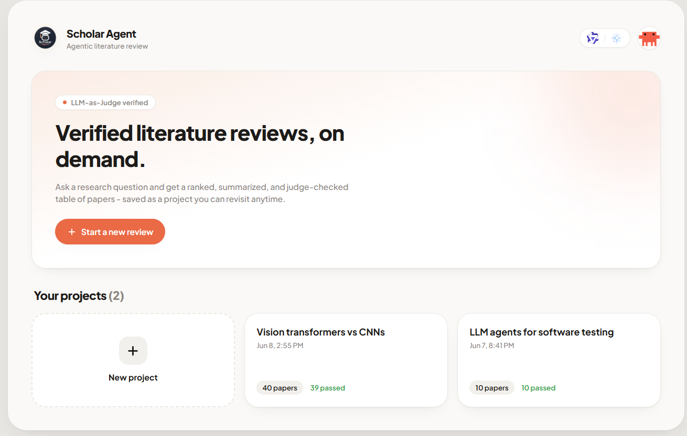
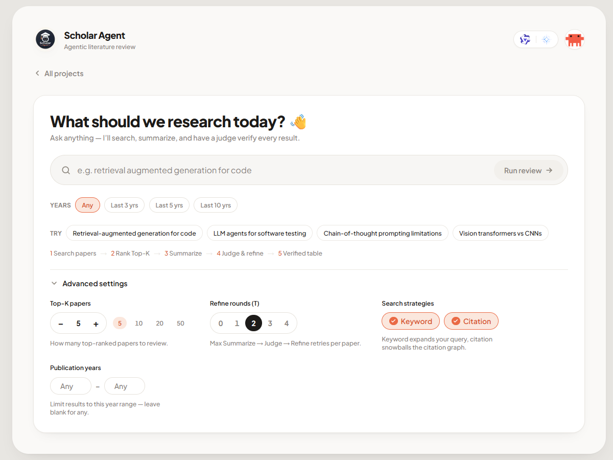
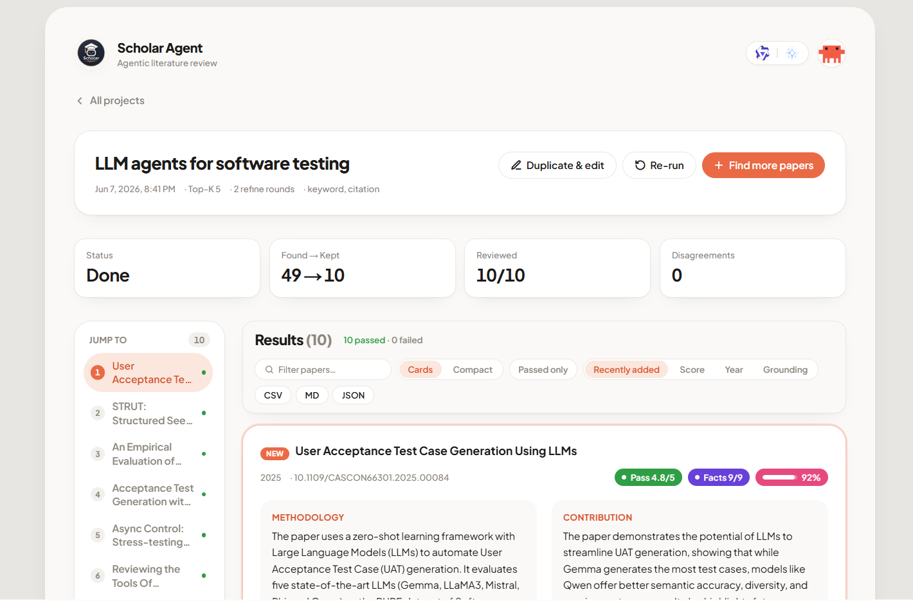
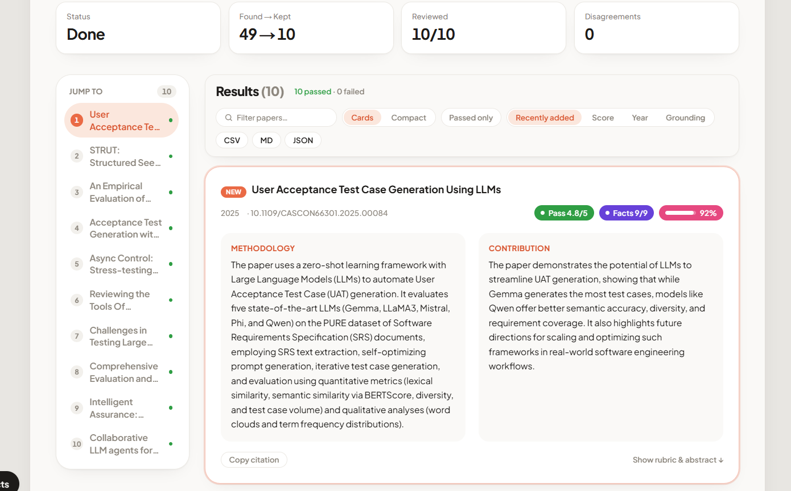

# Scholar Agent

**Scholar Agent** turns a research question into a verified, structured literature review. It searches academic papers, summarizes each into a structured record, and has a separate **LLM-as-Judge** check every summary against a rubric — refining until it passes — so the output stays grounded in the sources rather than hallucinated.

## Screenshots

**Dashboard — every review is saved as a project**



**New review — ask a question, scope the years, tune the search**



**Results — ranked, judge-verified papers with a filter, compact view, and a sticky jump-to index**



**Per-paper detail — methodology & contribution, rubric scores, and claim-by-claim faithfulness**



## Features

- **Agentic search** — an LLM expands your query into variants and snowballs the citation graph (Semantic Scholar), with an optional **publication-year scope**.
- **Transparent Top-K ranking** — candidates are deduplicated and ranked by an explainable proxy score (relevance, citations, recency, multi-strategy agreement).
- **Structured extraction** — each paper is distilled into *Methodology* and *Contribution*, with schema-validated JSON output (no free-form parsing).
- **LLM-as-Judge + refinement** — a second model grades every summary on **Clarity, Key Finding, Faithfulness, Consistency** (anchored 1–5 rubric) and loops **Summarize → Judge → Refine** until it passes. Pass/fail is computed in code, never left to the model.
- **Dual-model by design** — summarizer and judge are independent model families on separate endpoints, reducing single-model bias.
- **Claim-level faithfulness** — each summary is decomposed into claims and verified against the abstract (RAGAS/FActScore-style), plus a deterministic word-overlap grounding score.
- **Cross-paper disagreements** — surfaces where retrieved papers reach opposing conclusions, quoting the exact evidence.
- **Grow a review** — "Find more papers" adds new, non-overlapping results to an existing project; new papers are badged.
- **Built for long lists** — filter, a Cards/Compact toggle, and a sticky jump-to index.
- **Live + portable** — streamed progress (SSE), CSV / Markdown / JSON export, and reviews saved as projects.
- **Provider-agnostic** — works with **Ollama** (`/api/chat`) or any **OpenAI-compatible** (`/v1/...`) endpoint.

## How it works

```
query
  ▼  Search Agent     query expansion + citation snowballing (Semantic Scholar)
  ▼  Rank → Top-K     dedupe + transparent proxy ranking
  ▼  Summary Agent    structured Methodology / Contribution — abstract-grounded
  ▼  Judge ⇄ Refine   rubric scoring + faithfulness gate, up to T rounds
  ▼  Disagreements    candidate cross-paper contradictions (quoted)
  ▼  Results          verified rows + rubric + faithfulness, exportable
```

## Tech stack

Next.js 16 (App Router) · React 19 · TypeScript · Tailwind CSS v4 · Zod v4 (one schema source for runtime validation, the LLM's JSON-schema output, and types) · Semantic Scholar Graph API.

UI and API live in one Next.js app; the pipeline in `src/lib/` is framework-agnostic and unit-tested.

## Getting started

**Prerequisites:** Node.js 24+, one or two LLM endpoints (Ollama or OpenAI-compatible), and optionally a free [Semantic Scholar API key](https://www.semanticscholar.org/product/api) for higher rate limits.

```bash
npm install
cp .env.example .env      # fill in your endpoints, model names, and (optional) S2 key
npm run health            # verify summarizer LLM, judge LLM, and Semantic Scholar
npm run dev               # http://localhost:3000
```

### Configuration (`.env`)

| Variable | Meaning |
| --- | --- |
| `LLM_PROVIDER`, `LLM_BASE_URL`, `LLM_API_KEY` | Summarizer endpoint (`ollama` or `openai`) |
| `SUMMARY_MODEL` | Summarizer model name |
| `LLM_DISABLE_THINKING` | `true` to suppress reasoning traces (e.g. Qwen3 `<think>`) |
| `JUDGE_LLM_PROVIDER`, `JUDGE_LLM_BASE_URL`, `JUDGE_LLM_API_KEY` | Judge endpoint (falls back to the summarizer endpoint if unset) |
| `JUDGE_MODEL` | Judge model name |
| `S2_API_KEY` | Semantic Scholar API key (optional) |
| `TOP_K`, `MAX_ROUNDS` | Papers to keep; max refine rounds (*T*) |

## Run with Docker

The LLM endpoints and Semantic Scholar are reached over the network, so the container only needs internet access and your `.env`:

```bash
docker compose up --build       # builds the standalone image, serves on :3000
```

## Scripts

| Command | Description |
| --- | --- |
| `npm run dev` · `build` · `start` | Dev server · production build · serve |
| `npm run health` | Check summarizer LLM + judge LLM + Semantic Scholar |
| `npm run benchmark` | Judge discrimination benchmark → `docs/eval/` |
| `npm test` · `typecheck` · `lint` | Unit tests · TypeScript · ESLint |

## Project structure

```
src/
  app/            Next.js routes (UI + /api: reviews, health, export)
  components/     QueryForm, ProgressView, ResultsTable, …
  hooks/          useReview (SSE consumer)
  lib/
    schemas/      Zod contracts (Paper, PaperSummary, JudgeVerdict, Disagreement, …)
    llm/          provider-agnostic client, structured output, prompts
    clients/      Semantic Scholar client (rate-limit + retry)
    pipeline/     searchAgent, rank, summaryAgent, judge, refineLoop,
                  claimFaithfulness, disagreements, runReview
    eval/         faithfulness metric, discrimination benchmark, fixtures
test/             Vitest unit tests
scripts/          health, benchmark, probes
```
